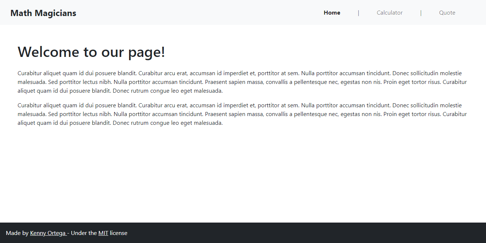
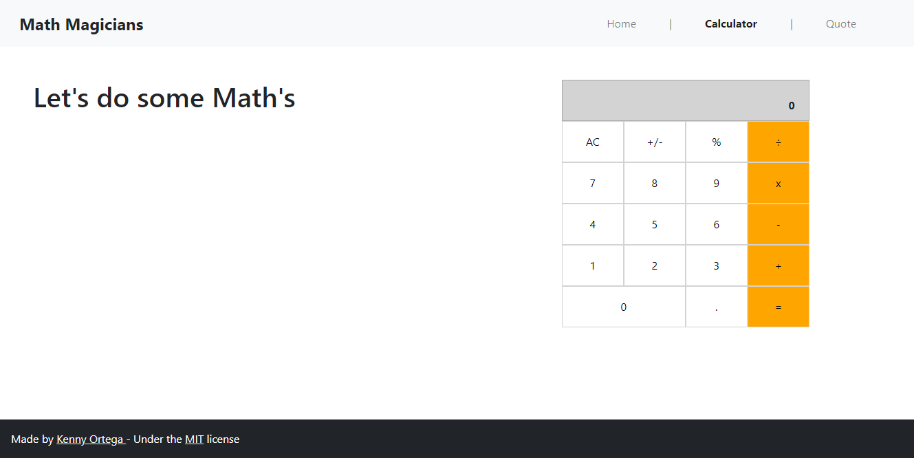
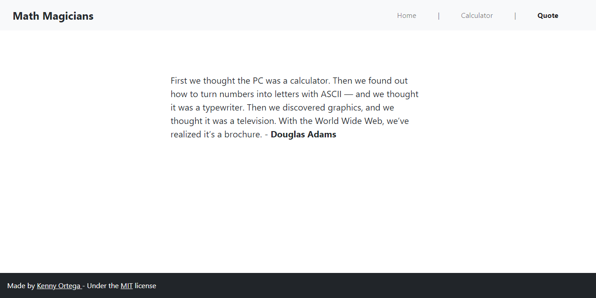

# Math Magicians

> "Math magicians" is a website for all fans of mathematics. It is a Single Page App (SPA) that allows users to:

- Make simple calculations.
- Read a random quote.

## 🖼️ Screenshots


> Home


> Calculator


> Quote

## 🌐 Live preview

[Math Magicians](https://kensayo.github.io/math-magicians/)

### 👷🏻 Built using
    - React
    - JavaScript
    - VSCode
    - GIT
    - Github
    - CSS
    - Bootstrap
    - Linters


## 🚩 Getting Started

To get a local copy up and running follow these simple example steps.

### ✅ Prerequisites

* Make sure that **Node JS** is installed in your computer (try to run _npm -v_ from your prompt), if not you can install it from [here.](https://nodejs.org/en/download/)


* [Download](https://github.com/kensayo/math-magicians/archive/refs/heads/dev.zip) and unzip **or** [clone this repository](https://docs.github.com/es/github/creating-cloning-and-archiving-repositories/cloning-a-repository)


### 👨🏻‍🔧 Setup

- Open your terminal and move to the root of the project, using ```cd``` command.
- You must run ```$npm start```
- Then your browser will open a local copy

### 🔌 Usage

- You can go to http://127.0.0.1:3000/ to use the app locally


## 👨🏻‍💻 Kenny Ortega

- GitHub: [kensayo](https://github.com/kensayo)
- Twitter: [@kensayo](https://twitter.com/kensayo)
- LinkedIn: [LinkedIn](https://www.linkedin.com/in/kennyortega/)


### 🤝🏻 Contributions and issues are welcome!

License
This project is [MIT](./MIT.md) licensed.
